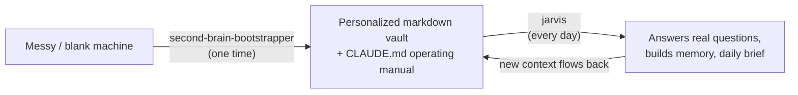
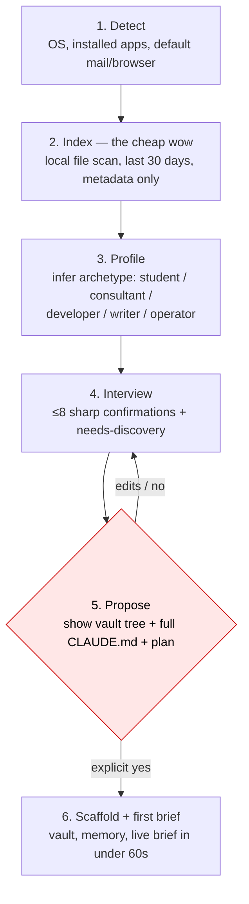
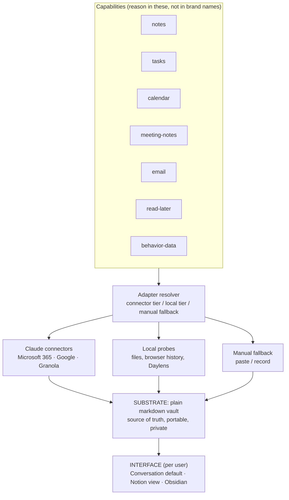
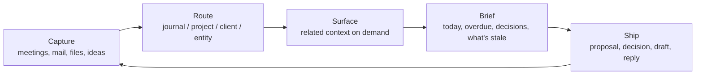
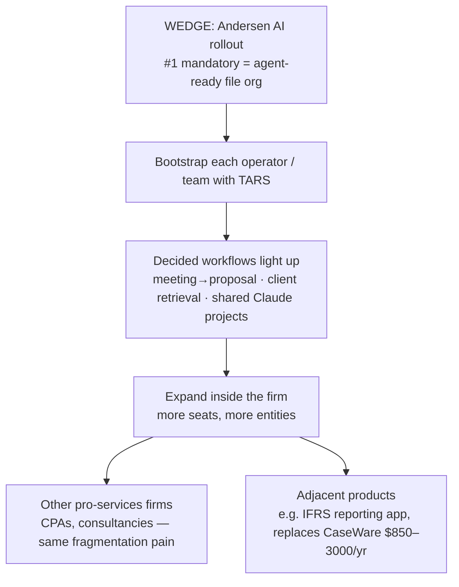

# TARS — End-to-End Product Overview

How the whole thing works, who it's for, and why it's monetizable. Pairs with `README.md` (what it is), `phase-0-walkthrough.md` (what's verified), and the vault note `Notes/Projects/Thinking brain/2026-06-17 James Meeting — Prep & Plan.md` (the live Andersen opportunity).

Diagrams are Mermaid. They render on GitHub and in Obsidian.

---

## 1. The one-sentence product

TARS turns a messy machine into an organized, **agent-ready** markdown second brain plus a maintainable operating manual, so a person or a firm can actually use AI on their real work instead of starting from chaos.

The deliverable is a **transformation, not an app**. After setup, the user lives in their existing Claude client and plain markdown files. Nothing to stare at.

## 2. Two skills: set it up, then run it

The bootstrapper *creates* the brain once. Jarvis *runs* it daily. Both ship in the same repo, installable as one skill.

## 3. How the bootstrapper runs (the setup)

Every probe and every write is announced and runs only on a yes. Consent for one step is never consent for the next.

## 4. Architecture: capabilities, adapters, substrate, interface

The core design choice: **model capabilities, not tools.** A working brain is produced even with zero integrations.

Two rules that make this durable:
- **Connectors over credentials.** Email/calendar/files/meetings come through the user's existing Claude connectors. TARS holds no tokens.
- **Substrate is not interface.** The source of truth is always markdown. Notion or Obsidian are optional *views*, never the source.

## 5. The daily value loop (what jarvis runs)

The metric is not "files saved." It is **work shipped per session**. Saving without consequence is hoarding.

## 6. Why it lasts (the moat)

Every "second brain with Claude" tutorial ends with a 2,000-line `CLAUDE.md` that goes stale and gets ignored. TARS generates the **discipline that keeps the system clean over months**, and that is the defensible IP:

- A line-capped `CLAUDE.md` (~300 lines) holding only prescriptive always/never rules + routing. A pointer, not a dump.
- A `MEMORY.md` index (~150 lines) pointing to scoped, single-topic `memory/*.md` files loaded only when relevant.
- The split rule: rules live in `CLAUDE.md`, changing facts live in memory, nothing duplicated.
- A session-audit behavior that files new rules/facts silently and archives past the ceiling.

Competitors generate a dump. TARS generates a system that maintains itself.

---

## 7. The market wedge: the Andersen AI rollout

This is not a cold product. From the AI strategy meeting (James, Norman, Ineza, Emmanuel), the firm already diagnosed the problem and named the first step.

> James: *"I'll have 15 different things working in a transition... I have to keep track of whether something will be delivered, if there's conflict, escalating... I need a place that helps me handle the project."*

Pain points named by the firm:
- Context fragmentation — teams go back to email to dig up client info.
- No shared, agent-ready knowledge base (unlike PwC/BCG internal bots).
- Tool overload — risk of 15,000 workflows nobody uses.
- Inconsistent AI outputs — no company voice.

Decisions the firm already made:
1. **Standardized, agent-ready file organization = the #1 mandatory rollout.** Without it, every other use case collapses.
2. Shareable Claude projects for a consistent company voice.
3. Meeting → proposal workflow (Granola + Claude).
4. Client-context retrieval workflow.

**TARS is the tool for decision #1.** The firm chose the off-the-shelf pieces (Claude for Office 365 at $25/mo, Granola free tier). What no off-the-shelf tool does is the agent-ready organization + the operating manual + the rollout itself. That gap is the product.

## 8. Monetization

The client already pays for the commodity layer (Claude for O365, Granola). TARS bills for the layer that makes those actually work.

| Line | What | Model |
|---|---|---|
| **Rollout / setup** | TARS-led transformation: detect, organize, scaffold the agent-ready vault + operating manual per operator/team | One-time engagement fee, per seat or per entity |
| **Managed operating layer** | Keep the system clean: routing, memory hygiene, upgrades, new workflows as the firm grows | Recurring retainer or per-seat monthly |
| **Workflow build-outs** | The decided workflows (meeting→proposal, client retrieval, company-voice Claude projects) | Per-workflow or bundled into the retainer |
| **Adjacent products** | IFRS reporting app and similar vertical tools surfaced during rollout | Separate SaaS / project pricing |

The framing for pricing: bill against the **time and risk removed** (slipped deadlines, lost context, re-keyed work), not against hours. One paying firm beats 10,000 free GitHub stars.

## 9. Honest risks

- **Internal-tool vs product conflation.** Delivering Andersen's rollout is a service. Turning the *method* into a repeatable product for other firms is the real prize. Don't let the first blur the second.
- **Windows validation gates everything.** Most target users are on Windows + Microsoft 365. `windows-probe.ps1` is written but unverified. Until it's proven on real hardware, the rollout is macOS-only in practice.
- **Trust.** Scanning a firm's machines is a high-trust ask. The connector-first, on-device, consent-gated design is the answer, and it must stay non-negotiable.
- **Founder bandwidth.** This competes with Daylens, Andersen content, ALU, and a half marathon. The Andersen rollout is the one with a warm buyer and a named budget. That's where the focus belongs.

## 10. End to end, in one breath

A firm has chaos across machines and inboxes. TARS scans one operator's machine, shows them their own last 30 days, infers who they are, confirms in a few questions, and with consent scaffolds a clean markdown brain plus an operating manual that won't rot. Their existing Claude connectors feed it live mail, calendar, and meetings. From then on they talk to it: it briefs them each morning, retrieves any client's full history in seconds, and turns a recorded meeting into a proposal in the firm's voice. Repeat per person, and the firm has the agent-ready knowledge base it said it needed. That rollout is the service. The method behind it is the product.
